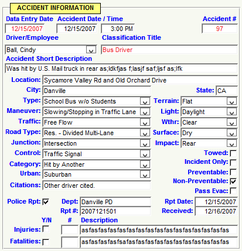
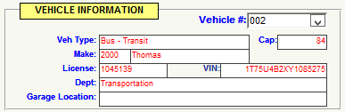

## Accident Information Group

### Data Entry Date

The Data Entry Field is a Date/Time field, and defaults to the current date that the record is entered into the TransTraks System. Normally, you will not even need to enter this field as the date is entered for you automatically. The date format is MM/DD/YYYY. The Data Entry Date is a required field. However, it is entered for you automatically by TransTraks.

### Accident Date and Time

The Accident Date is a Date/Time field, with a date format of mm/dd/yyyy. This is the date of the accident and is a required field. The Time field is the time of the accident and uses the format hh:mm am/pm (Example: 03:00 PM) and is a required field.

## Vehicle Information Group

The Vehicle Information Group (note image with circled area to the right) is where you insert data about the vehicle involved in the accident. All you need to do is select the correct vehicle from the Vehicle Drop Down Combo Box in the upper right hand corner of the group (Vehicle #). Once you select the correct vehicle, the resst of the fields in the group will automatically be populated. All of these fields are read only. You will not need to enter data in these fields.

